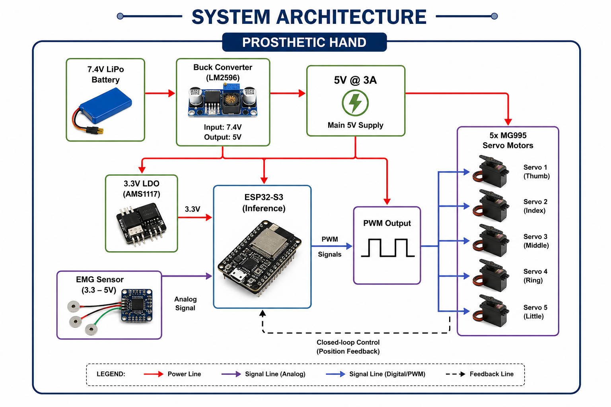

# 🧠 Neuromorphic AI-Powered Prosthetic Hand

[](LICENSE)
[](https://www.python.org/)
[](https://www.tensorflow.org/)
[](https://www.espressif.com/)

> **A Low-Cost Intelligent Control System Using GRU Networks and Custom EMG Dataset**

---

## 🚀 Overview

This project presents the development of a **neuromorphic-inspired prosthetic hand control system** that leverages deep learning to translate electromyographic (EMG) signals into intuitive hand gestures.  

✨ Achieves **98.2% accuracy** across **37 distinct gestures** using a **GRU-based model** trained on a **74,000-sample custom dataset**.

---

## 📑 Table of Contents

- [✨ Key Features](#-key-features)
- [🏗️ System Architecture](#️-system-architecture)
- [🛠️ Hardware Components](#️-hardware-components)
- [📊 Custom Dataset](#-custom-dataset)
- [🧠 Deep Learning Model](#-deep-learning-model)
- [📈 Results](#-results)
- [🚀 Getting Started](#-getting-started)
- [🔮 Future Work](#-future-work)
- [📁 Repository Structure](#-repository-structure)
- [📜 License](#-license)
- [📧 Contact](#-contact)

---

## ✨ Key Features

| Feature | Description |
|--------|------------|
| 🎯 **High Accuracy** | 98.2% across 37 gesture classes |
| 💰 **Low Cost** | Affordable and accessible hardware |
| 📊 **Custom Dataset** | 74,000 EMG + flex + FSR samples |
| 🖐️ **Finger Control** | Independent 5-servo actuation |
| 🔋 **Portable Power** | Battery-powered system |
| 🔓 **Open Source** | Full stack (hardware + AI) |

---

## 🏗️ System Architecture




---

## 🛠️ Hardware Components

### Core Components

| Component | Specification | Purpose |
|----------|-------------|--------|
| Microcontroller | ESP32-S3 DevKit | Processing & inference |
| EMG Sensor | Surface EMG (3.3–5V) | Signal acquisition |
| Actuators | 5x MG995 Servos | Finger movement |
| Power | 7.4V LiPo + Buck | 5V supply |
| Mechanical | 3D Printed Hand | Structure |

### Pin Configuration

| Servo | GPIO | Finger |
|------|------|--------|
| 1 | 13 | Thumb |
| 2 | 14 | Index |
| 3 | 15 | Middle |
| 4 | 16 | Ring |
| 5 | 17 | Little |

---

## 📊 Custom Dataset

### Statistics

| Parameter | Value |
|----------|------|
| Samples | 74,000 |
| Classes | 37 |
| Features | 12 |
| Sampling Rate | 100 Hz |
| Window | 20 timesteps |

### Feature Vector


x = [EMG_adc, EMG_rms, Flex_thumb, Flex_index, Flex_middle,
Flex_ring, Flex_pinky, FSR_thumb, FSR_index, FSR_middle,
Spike_Rate, Membrane_Potential]


---

## 🧠 Deep Learning Model

### Architecture

- 2 × GRU Layers (128 units)
- Fully Connected Layers
- Softmax Output (37 classes)

### Training Config

| Parameter | Value |
|----------|------|
| Optimizer | Adam |
| LR | 0.0003 |
| Batch Size | 64 |
| Epochs | 100 |

---

## 📈 Results

| Metric | Value |
|-------|------|
| Training Accuracy | 99.1% |
| Testing Accuracy | 98.2% |
| F1 Score | 0.98 |

---

## 🚀 Getting Started

### Installation

```bash
git clone https://github.com/yourusername/neuromorphic-prosthetic-hand.git
cd neuromorphic-prosthetic-hand
pip install -r requirements.txt
Training
python train.py
Inference
python inference.py
ESP32 Deployment
idf.py set-target esp32s3
idf.py build
idf.py flash monitor
```

## 🔮 Future Work

- Neuromorphic SNN deployment
- TensorFlow Lite Micro optimization
- Expanded dataset (more subjects, amputees)
- Sensor fusion (IMU, force feedback)

---

## 📁 Repository Structure

```
hardware/
firmware/
model/
dataset/
notebooks/
docs/
```

---

## 📜 License

MIT License

---

## 📧 Contact

- Suhani Verma
- Suhani Pare
- Sudha Singh
- Subhanshi Saxena 

---

⭐ Star the repository if you found this useful

